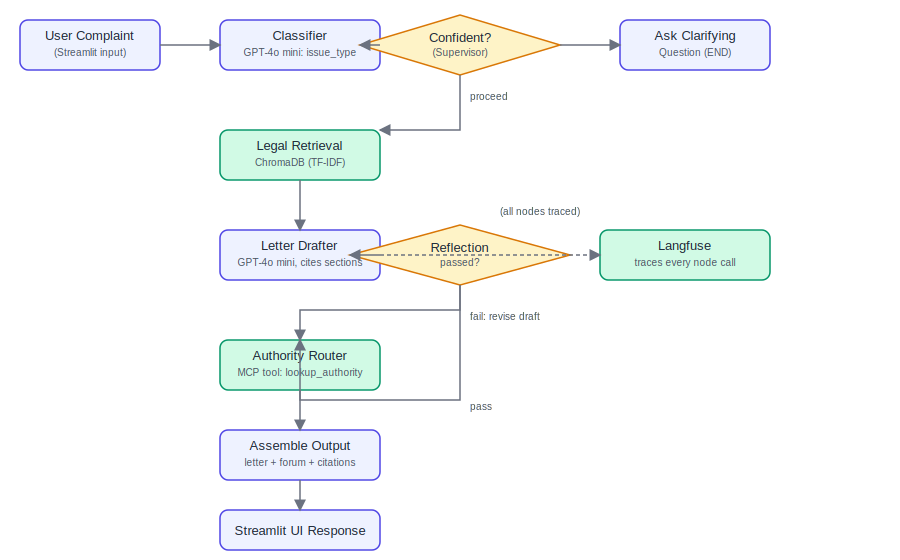

<div align="center">

#  HaqDar
### AI Consumer Rights Advisor — Sindh, Pakistan

*Describe your consumer complaint. HaqDar tells you your legal rights, drafts your complaint letter, and tells you exactly where to file it.*

[](https://haqdar-a5wufx4ku9sazq9odurvyq.streamlit.app/)

[](https://python.org)
[](https://streamlit.io)
[](https://langchain-ai.github.io/langgraph/)
[](https://openai.com)
[](https://www.trychroma.com/)
[](#license)

</div>

---

## 🎥 Demo

<div align="center">

<video src="docs/haqdar-demo.mp4" controls width="720">
  Your browser doesn't support embedded video —
  <a href="docs/haqdar-demo.mp4">download the demo here</a>.
</video>

**👉 [Try the live app yourself](https://haqdar-a5wufx4ku9sazq9odurvyq.streamlit.app/)**

</div>

> [download it directly](docs/haqdar-demo.mp4).

---

## ✨ What It Does

1. **📝 Describe your complaint** — in plain, everyday language.
2. **🔍 Classifier Agent** — GPT-4o mini identifies the issue type (defective product, defective service, unfair/deceptive practice, or pricing/receipt/disclosure) — or asks a clarifying question if it's unclear, instead of guessing.
3. **📚 Legal Retrieval** — searches a ChromaDB knowledge base of all 48 sections of the **Sindh Consumer Protection Act, 2014** (+ 2017 Rules) for the most relevant provisions.
4. **✍️ Letter Drafter** — GPT-4o mini drafts a formal complaint letter, citing *only* the retrieved section numbers.
5. **🔁 Reflection Loop** — a second GPT-4o mini pass checks the draft against the actual retrieved legal text, catching hallucinated citations before you ever see them.
6. **🏛️ Authority Router** — maps your issue to the correct forum (Consumer Court vs. the Authority) plus any filing pre-requisites (e.g. the mandatory 15-day notice under §29).
7. **📬 Optional delivery** — look up the shop's contact info, review it, and send the notice yourself — nothing is ever sent automatically.

Every node call is traced via **Langfuse** when configured.

---

## 🏗️ Architecture



```
Complaint Text
      │
      ▼
┌─────────────┐     low confidence      ┌───────────────────────┐
│ Classifier   │ ──────────────────────▶ │ Ask Clarifying Question│
└─────┬───────┘                          └───────────────────────┘
      │ confident
      ▼
┌─────────────┐
│ Legal        │  ChromaDB · 48 sections, TF-IDF + trigger phrases
│ Retrieval    │
└─────┬───────┘
      ▼
┌─────────────┐        fails check       ┌─────────────┐
│ Letter       │ ◀───────────────────────│ Reflection   │
│ Drafter      │ ───────────────────────▶│ (fact-check) │
└─────┬───────┘        passes            └─────────────┘
      ▼
┌─────────────┐
│ Authority    │  Consumer Court vs. Authority + filing pre-reqs
│ Router       │
└─────┬───────┘
      ▼
  Final Letter + Cited Sections + Filing Instructions
```

---

## 🗂️ Project Structure

```
haqdar/
├── agents/                      # LangGraph pipeline — the actual "brain"
│   ├── state.py                 #   shared graph state schema
│   ├── llm.py                   #   shared ChatOpenAI client
│   ├── classifier.py            #   Node 1 — intake/classification
│   ├── retrieval_node.py        #   Node 2 — legal retrieval (ChromaDB)
│   ├── drafter.py               #   Node 3 — letter drafter
│   ├── reflection.py            #   Node 4 — reflection/critique loop
│   ├── authority_router.py      #   Node 5 — authority/forum routing
│   ├── company_lookup.py        #   shop/company contact search (Tavily)
│   ├── delivery_node.py         #   Node 6 — email delivery (Gmail SMTP)
│   ├── graph.py                 #   graph wiring + supervisor routing
│   └── tracing.py               #   Langfuse tracing wrapper
│
├── frontend/                    #   Deployed app — Streamlit, single service
│   ├── streamlit_app.py         #   guided intake wizard + full UI
│   ├── local_agent_client.py    #   calls agents/ directly, in-process
│   ├── requirements.txt         #   full dependency set for this deploy
│   ├── api_client.py            #   (alt. path) HTTP client for split deploy
│   └── config.py                #   (alt. path) config for split deploy
│
├── backend/                     # Optional: separate FastAPI backend
│   └── main.py                  #   only needed for the frontend/backend
│                                 #   split deployment — see "Alternative
│                                 #   Deployment" below
│
├── data/
│   ├── build_dataset.py         # builds scpa_dataset.json from the Act text
│   └── scpa_dataset.json        # 40 Act sections + 8 Rules sections + routing
│
├── rag/
│   ├── build_index.py           # embeds dataset into ChromaDB (TF-IDF)
│   ├── retriever.py             # retrieval function used by agents
│   └── chroma_db/                # persistent Chroma collection
│
├── mcp_server/
│   └── server.py                # exposes lookup_authority + search_consumer_law
│
├── app/
│   └── main.py                  # legacy Gradio UI (quick local testing)
│
├── docs/
│   ├── architecture.svg
│   └── haqdar-demo.mp4          # add the demo video here
│
├── tests/
├── config.py                    # central paths/model config
├── requirements.txt              # legacy combined deps
├── docker-compose.yml
├── .env.example
└── README.md
```

---

## 🚀 Live Demo

**[https://haqdar-a5wufx4ku9sazq9odurvyq.streamlit.app/](https://haqdar-a5wufx4ku9sazq9odurvyq.streamlit.app/)**

Deployed as a single Streamlit Community Cloud app — `frontend/streamlit_app.py` calls the LangGraph agent pipeline directly in-process (no separate backend to host).

---

## 🛠️ Tech Stack

| Layer | Technology |
|---|---|
| Agent orchestration | LangGraph |
| LLM | OpenAI GPT-4o mini |
| Vector store | ChromaDB (TF-IDF embeddings) |
| Company/contact search | Tavily (via MCP) |
| Observability | Langfuse |
| UI | Streamlit |
| Legacy UI | Gradio |
| Email delivery | Gmail SMTP |

---

## ⚙️ Setup (Local Development)

```bash
git clone <your-repo-url>
cd haqdar
pip install -r frontend/requirements.txt
cp .env.example .env    # fill in OPENAI_API_KEY (and Tavily/Gmail/Langfuse keys as needed)
```

### Build the knowledge base
```bash
python data/build_dataset.py   # generates data/scpa_dataset.json
python rag/build_index.py      # embeds into ChromaDB, prints retrieval sanity checks
```

### Run locally
```bash
streamlit run frontend/streamlit_app.py
```
Visit `http://localhost:8501`.

### Run the legacy Gradio UI (optional)
```bash
pip install -r requirements.txt
python app/main.py
```
Visit `http://localhost:7860`.

---

## ☁️ Deploying Your Own Copy

1. Push this repo to GitHub (make sure `.env` is **not** committed — check `.gitignore`).
2. Go to [share.streamlit.io](https://share.streamlit.io) → **New app**.
3. Point it at your repo, branch `main`, main file path `frontend/streamlit_app.py`.
4. Under **Advanced settings → Secrets**, add:
   ```toml
   OPENAI_API_KEY = "sk-..."
   TAVILY_API_KEY = "tvly-..."          # optional
   GMAIL_ADDRESS = "you@gmail.com"      # optional
   GMAIL_APP_PASSWORD = "xxxx xxxx xxxx xxxx"  # optional
   LANGFUSE_PUBLIC_KEY = "pk-lf-..."    # optional
   LANGFUSE_SECRET_KEY = "sk-lf-..."    # optional
   ```
5. Deploy.

### Alternative Deployment (FastAPI backend + Streamlit frontend split)
For a production setup where the UI never holds secrets directly, `backend/` and the original `frontend/api_client.py` support a two-service split (FastAPI backend + Streamlit frontend talking over HTTP). See inline comments in `frontend/streamlit_app.py` and `backend/main.py` for how to switch back to that path, and `docker-compose.yml` for running both together.

---

## 🔒 Security Notes

- **Secrets never touch the repo** — only `.env.example` (placeholders) is committed; real `.env` is gitignored.
- **No leaked internals** — errors are logged server-side, never exposing stack traces or file paths to the UI.
- **Human-in-the-loop email delivery** — nothing is ever sent automatically; the consumer reviews the drafted letter and shop contact info, then explicitly confirms before anything is emailed.

---

## 📖 Sample Interaction

**Input:**
> "I bought a washing machine two weeks ago and it stopped working. The shop refuses to repair or replace it."

**Output:**
- **Classified as:** Defective Product
- **Cited sections:** Act §4 (Liability for defective products), Act §29 (Settlement of Claims — mandatory notice), Act §32 (Order of Consumer Court)
- **Forum:** Consumer Court (District level, presided by Judicial Magistrate)
- **Draft letter:** formal notice citing §4 and §29, demanding repair/replacement/refund within 15 days per the mandatory pre-filing notice requirement

---

## 💡 Design Notes

- **Why TF-IDF instead of OpenAI embeddings:** the corpus is small (48 sections) with distinctive legal vocabulary; TF-IDF avoids an external embedding-model dependency for local dev. Section text is enriched with plain-language "trigger phrases" (e.g. "phone stopped working" → §4) to bridge everyday complaint language and legal terminology.
- **Why reflection matters:** legal citation accuracy is the single biggest failure mode for an LLM-drafted legal letter. The reflection node is a genuine second LLM pass checking the draft against ground-truth retrieved text, not just a formatting check.
- **Jurisdiction scope:** Sindh only, matching the source Act. Federal/other-provincial consumer protection laws are out of scope for this MVP.

---


<div align="center">

**Author:** Midhat Maryam

[](https://haqdar-a5wufx4ku9sazq9odurvyq.streamlit.app/)

</div>
